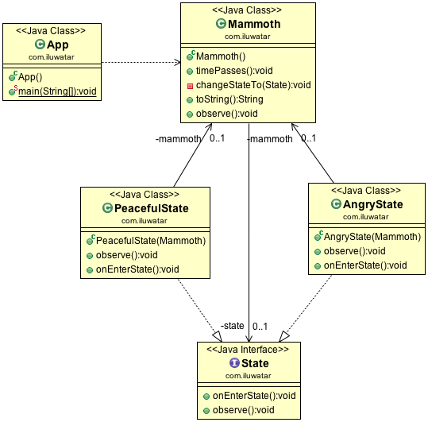

# 状态模式介绍

### 状态模式：

当一个对象的内在状态改变时允许改变其行为，这个对象看起来像是改变了其类

状态模式主要解决的是当控制一个对象状态转换的条件表达式过于复杂时的情况。

把状态的判断逻辑转移到表示不同状态的一系列类当中，可以把复杂的判断逻辑简化。

当遇到不同的状态遇到不同的行为的时候，可以使用状态模式

State（抽象状态类）：定义一个接口以封装与Context的一个特定状态相关的行为。

ConcreteStateA，B，C（具体状态）：每一个子类实现一个不同的状态或行为

Context（上下文）：维护一个State子类状态的实例，这个实例中定义了当前的状态。

### 状态模式的好处：

1、可以将不同状态的不同行为分割开来，将相关的行为进行局部化。以便更改局部状态

2、消除了庞大的条件分支语句。

### 什么时候使用状态模式呢？

当一个对象的行为取决于它的状态，并且它必须在运行时刻根据状态改变它的行为时，就可以考虑使用状态模式了。

### 参考

* [Java23种设计模式学习笔记](https://www.cnblogs.com/cxxjohnson/p/6403835.html)
* [java-design-patterns](https://github.com/iluwatar/java-design-patterns)