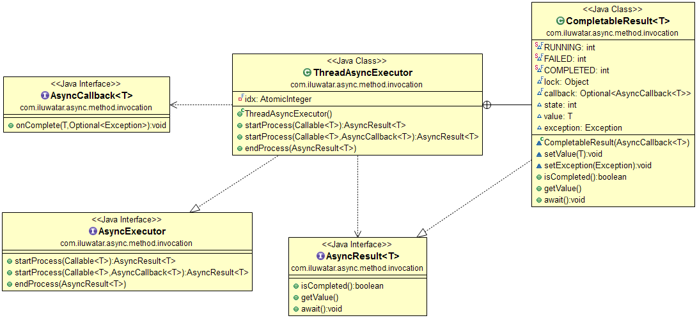

## Page

* [异步方法调用](https://java-design-patterns.com/patterns/async-method-invocation/)

## Intent
Asynchronous method invocation is pattern where the calling thread
is not blocked while waiting results of tasks. The pattern provides parallel
processing of multiple independent tasks and retrieving the results via
callbacks or waiting until everything is done. 

异步方法调用是一种模式，其中在等待任务结果时不会阻塞调用线程。该模式提供了对多个独立任务的并行处理，并通过回调或等待一切完成后检索结果。

## Applicability
Use async method invocation pattern when

* you have multiple independent tasks that can run in parallel
* you need to improve the performance of a group of sequential tasks
* you have limited amount of processing capacity or long running tasks and the
  caller should not wait the tasks to be ready

适用性
在以下情况下使用异步方法调用模式

* 您有多个可以并行运行的独立任务
* 您需要提高一组顺序任务的性能
* 您的处理能力有限或任务长时间运行，并且调用方不应等待任务准备就绪

## Real world examples

* [FutureTask](http://docs.oracle.com/javase/8/docs/api/java/util/concurrent/FutureTask.html), [CompletableFuture](https://docs.oracle.com/javase/8/docs/api/java/util/concurrent/CompletableFuture.html) and [ExecutorService](http://docs.oracle.com/javase/8/docs/api/java/util/concurrent/ExecutorService.html) (Java)
* [Task-based Asynchronous Pattern](https://msdn.microsoft.com/en-us/library/hh873175.aspx) (.NET)
