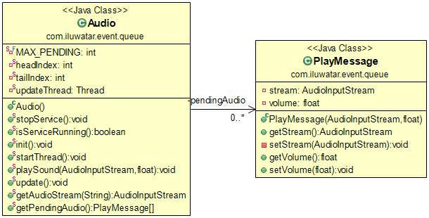

## Intent
Event Queue is a good pattern if You have a limited accessibility resource (for example: 
Audio or Database), but You need to handle all the requests that want to use that.
It puts all the requests in a queue and process them asynchronously.
Gives the resource for the event when it is the next in the queue and in same time
removes it from the queue.

如果可访问性资源有限（例如：音频或数据库），那事件队列是一个很好的模式，但是您需要处理所有要使用的请求。它将所有请求放入队列并异步处理它们。当事件是队列中的下一个事件时，为事件提供资源，同时将其从队列中删除。

## Applicability
Use the Event Queue pattern when

* You have a limited accessibility resource and the asynchronous process is acceptable to reach that

## Credits

* [Mihaly Kuprivecz - Event Queue] (http://gameprogrammingpatterns.com/event-queue.html)
