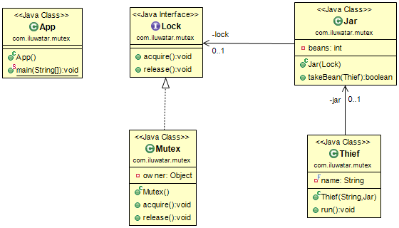

## Also known as
Mutual Exclusion Lock
Binary Semaphore

## Intent
Create a lock which only allows a single thread to access a resource at any one instant.

创建一个只允许单个线程在任何时刻访问资源的锁。

## Applicability
Use a Mutex when

* you need to prevent two threads accessing a critical section at the same time
* concurrent access to a resource could lead to a race condition 

使用互斥时

* 您需要防止两个线程同时访问关键部分
* 同时访问资源可能会导致竞争状况

## Credits

* [Lock (computer science)] (http://en.wikipedia.org/wiki/Lock_(computer_science))
* [Semaphores] (http://tutorials.jenkov.com/java-concurrency/semaphores.html)
