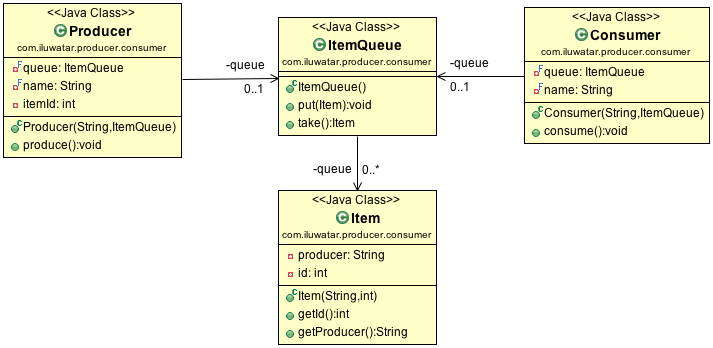

## Page

* [生产者消费者](https://java-design-patterns.com/patterns/producer-consumer/)

## Intent
Producer Consumer Design pattern is a classic concurrency pattern which reduces
 coupling between Producer and Consumer by separating Identification of work with Execution of
 Work.
 
 生产者消费者设计模式是一种经典的并发模式，通过将工作标识与工作执行分开来减少生产者与消费者之间的耦合。

## Applicability
Use the Producer Consumer idiom when

* decouple system by separate work in two process produce and consume.
* addresses the issue of different timing require to produce work or consuming work

在以下情况下使用生产者消费者习惯用法

* 通过两个过程中的单独工作将系统解耦产生和消耗。
* 解决生产工作或消费工作需要不同时间的问题