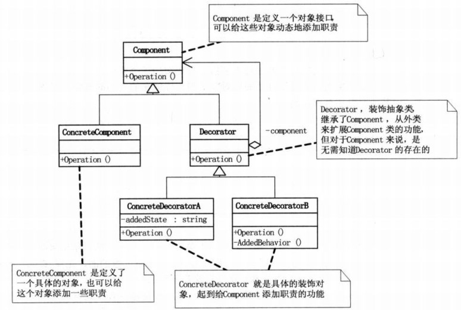

# 装饰模式介绍

### 装饰模式（decorator）：

表示动态的给一个对象添加一些新的功能（利用子类继承父类也可以实现），但是比生成子类方式更灵活。也叫装饰者模式或者装饰器模式

例如：我们每个人身上穿的衣服，鞋子，领带，披风都可以理解为是对人的装饰。

### 装饰器模式类图：

Component：定义一个对象接口，可以给这些对象动态添加职责。真实对象和装饰者对象有相同的接口，这样客户端不用知道内部有装饰者对象（Decorator）

存在的，还是以之前处理真实对象的相同方式来和装饰者对象交互。

ConcreteComponent：是定义了一个具体的对象（例如：人），也可以给这个对象添加一些其他职责。

Decorator：装饰抽象类，继承了Component，从外类来扩展Component类的功能，但对Component来说，是无需知道Decorator存在的。

ConcreteDecorator：就是具体的装饰对象了（衣服，鞋子..），它起到了给Component添加职责的功能。

### 总结

装饰模式（Decorator）也叫包装器模式（Wrapper）

装饰模式降低系统的耦合度，可以动态的增加或删除对象的职责，并使得需要装饰的具体构建类和具体装饰类可以独立变化

以便增加新的具体构建类和具体装饰类。

* 优点：

扩展功能强，相比继承来说更灵活。继承的话会导致子类个数增加。而装饰者模式不会出现这种情况。

可以对一个对象进行多次装饰，创造出不同行为的组合，得到功能更加强大的对象。

具体构建类和具体装饰类可以独立变化，用户可以根据需要自己增加新的构件子类和具体装饰类。

* 缺点：

产生很多小对象，大量小对象会占据内存。一定程度上影响了性能。

装饰模式易于出错，调试排查比较麻烦。 

### 开发中应用的场景：

IO中输入流和输出流

Swing包中图形界面构件功能

Servlet API中提供了一个request对象的Decorator设计模式的默认实现类HttpServletRequestWrapper,增强了request对象的功能。

Struts2中，request，response，session对象的处理。

### 装饰模式和桥接模式的区别：

两个模式都是为了解决过多子类对象的问题，桥接模式是对象自身有过多的维度，造成过多的子类。而让维度分类后在搭建一个桥梁来联系起来。

而装饰模式是解决在增加新功能的时候产生多个类的问题。

### 参考

* [Java23种设计模式学习笔记](https://www.cnblogs.com/cxxjohnson/p/6403835.html)
* [java-design-patterns](https://github.com/iluwatar/java-design-patterns)